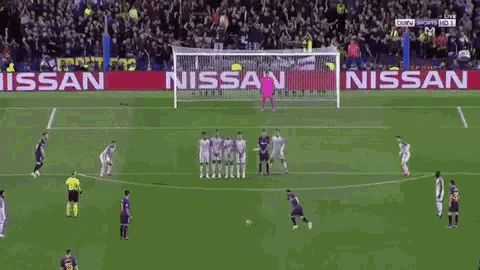
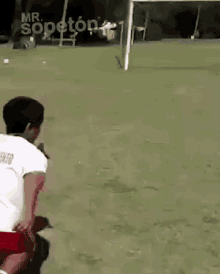
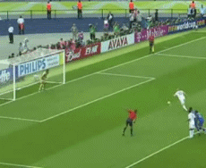
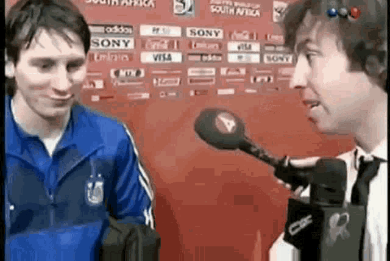

# FIFA
## Proyecto Programación

### El juego consiste en una tanda de penales.

## INSTRUCCIONES

EL JUEGO SE JUGARÁ CON LA PANTALLA COMPLETA

El juego es para dos jugadores:               
Uno jugará con el pateador y el otro jugará con el portero

El pateador jugará con las teclas 's' 'w'. 
Los cuales servirán para mover el balón hacia arriba y hacia abajo.

El portero jugará con las flechas. Las cuáles servirán para mover al portero

Cabe recalcar que el balón tiene una aceleración constante, el jugador no podra detener el balón, solo podrá cambiar la dirección a la que va.

## Puntaje
Por cada gol que marque el jugador será 1 punto

Por cada portería imbatida que tenga el portero será un punto

El juego termina cuando un jugador llegue a los 5 puntos

## ¿Cómo jugar?

El juego consiste en que el pateador tirará el penal y podrá mover la dirección del balón con las teclas ya mencionadas para intentár marcar gol en la portería rival y podrá cambiar la dirección del balón con la tecla 'p' para distraer al portero.

Se tendrá que refrescar la terminal por cada penal, esto se puede hacer tecleando la tecla 'q' del teclado y después tecleando 'make run' en la terminal para poder volver a tirar otro penal.

# Esto es todo, diviértete ganandole a tus amigos.

